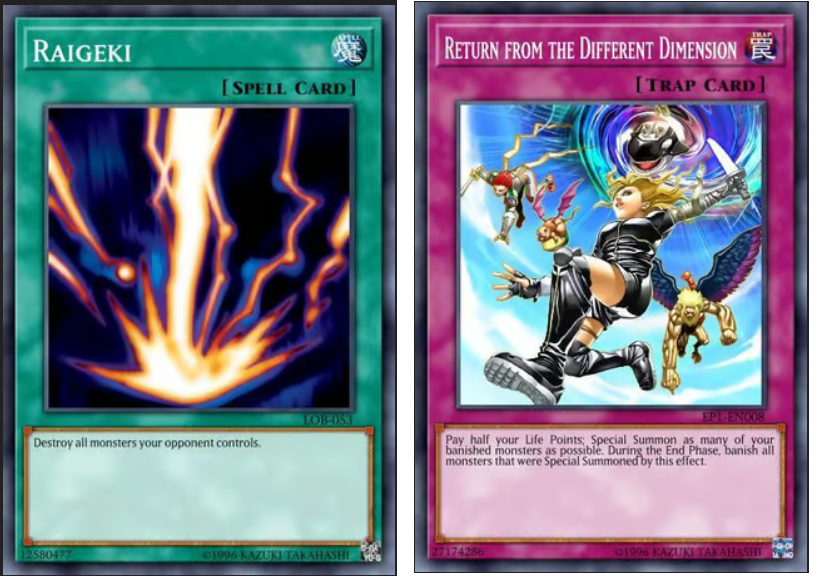
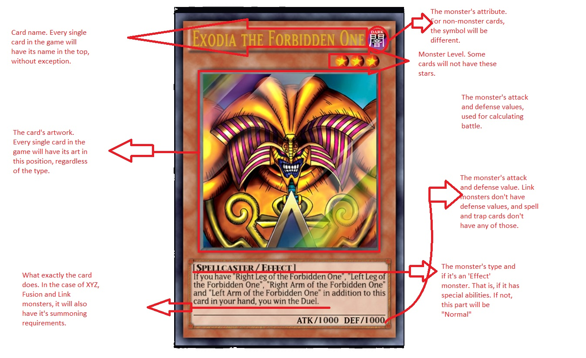
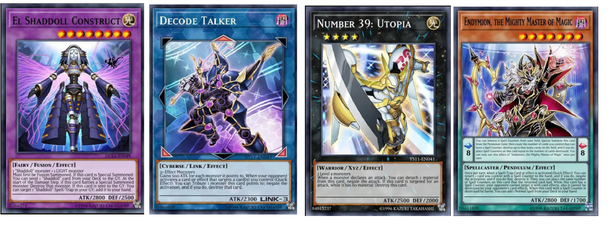
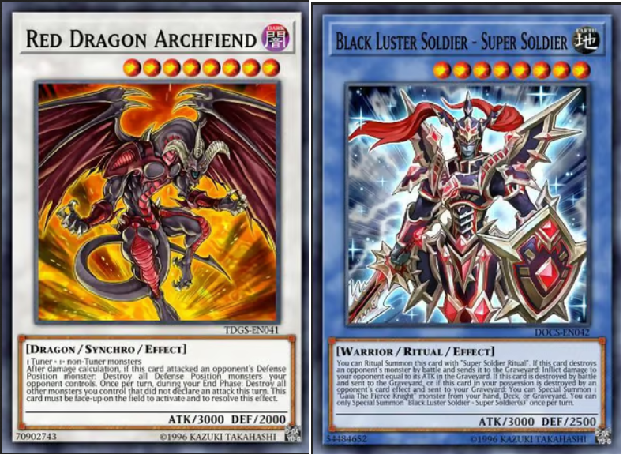
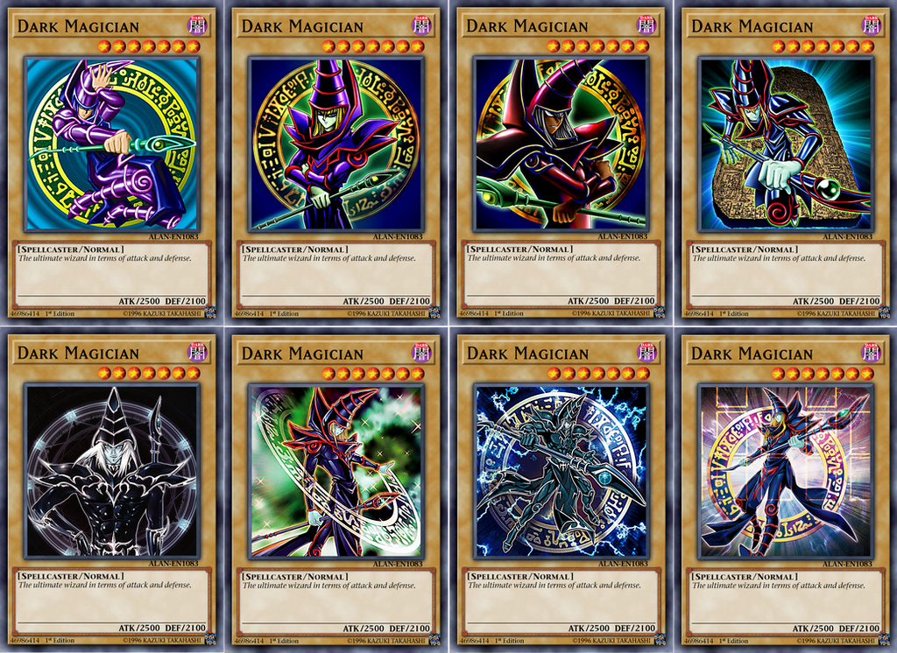

# Yu-gi-oh! TCG Inferential Analysis


## Introduction

Yu-gi-oh! is one of the strongest IPs on the entertainment industry to have come
from Japan. The franchise, which started with the same name manga from 1996 grew
to become a true powerhouse, spanning many works related to it such as many
anime adaptations, movies and an array of merchandising. However, the most
impactful and impressive work related to the IP is the eponymous card game,
which originally spawned by the manga.

The trading card game was launched by *Konami* in 1999 in Japan and March 2002
in North America.^[^ As of January 2021, the game is estimated to have sold
about 35 billion cards worldwide and grossed over ¥1 trillion (\$9.64 billion).
Needless to say, it has an impressive fame.

Throghout over two decades of existence, the card game has launched more than 12
thousand cards in its history. This analysis will try to do an inferential
analysis on the available card data.

## Considerations

Before we begin our analysis, we need to do some considerations first.

-   This study will focus solely on the western release of the card game, named
    TCG for Trading Card Game. The original card game, named OCG or basically
    the original japanese version works with a slightly different cardpool and
    restrictions than its western counterpart.

-   This study will be based on a database provided in the link
    <https://github.com/Pietracoops/yugioh_cardlist_scraper/releases>.

-   The latest data comes from the "Battle of Legend: Crystal Revenge" pack,
    launched in 2022/18/12.

-   This analysis will be conducted in R programming language using Rstudio.

-   This dataset goes until november 2022, and so it uses values from that time.
    This is included in the banlist for the game. Yu-gi-oh!, just like many card
    games occasionally decides to ban or limit certain cards in order to promote
    competitive balancing. A banned card will be listed as "Forbidden" in the
    dataset, and cards with no restriction are marked as "Unlimited".

## Before We Start

First of all, we need to have a basic understanding of how exactly are the
Yu-gi-oh! cards. This will make the classification more understandable. For the
sake of this presentation we don't need to go by the game's rules and its
intricacies, but it's important we understand how its cards are classified.

By and large, there are 3 type of cards in "Yu-gi-oh!". Monster cards, Spell
cards and Trap cards. While spell and trap cards have different classifications
of how they are used, they all share common colors. Regardless of the type, all
spell cards will have the same turquoise-blue color, and all the trap cards will
have a violet like color, like the examples below.



Now, an example of an average monster card

{width="721"}

And finally, examples of the remaining types of cards





These are examples of each type of card that we see in the card game. Now let's
move on to the analysis.

## Prepping the Data

After we download the data and extract it, we can take a look on it and
understand its formatting. All the tables in the dataset are saved separately as
CSV files and sorted by its release set. Some cards are released in what we call
"Booster boxes", packages that have a randomized chance of having certain cards
when opening them. Others come in special sets such as tins, special packs
releasing with movies or events, and others even come in pre-made ready-to-play
decks called "Structure Decks". This division by itself could warrant an
analysis, but that wont be necessary for this study.

For those who are not familiar with the game itself but are curious on how to
play it, I recommend the link

<https://www.wikihow.com/Play-Yu-Gi-Oh!>

Since the data we downloaded are in CSV format, we might want to change the
relevant data to Integer type. For the game of Yu-gi-Oh!, the following values
are very important numerically: attack, defense, Link, Rank, Level and Pendulum
Scale. Also, for the sake of simplicity, let's convert all of the files into a
single table. Since the separating value is a "\$", we need to specify it in our
code. I'm also going to include the source of each table in a separate column,
it might be useful for our analysis.

```{r include=FALSE}
library(ggplot2)
library(tidyr)
library(dplyr)
library(readr)
library(tools)
library(stringr)
library(cluster)
library(purrr)
install.packages("reshape2")
library(reshape2)
```

I've already compiled all of the dataset into a single CSV file in order to
facilitate the reading and make things simpler while analyzing.

Now, we may have a quick glance at the data using R.

```{r}

data <- read.csv("C:/Users/Lucas/Documents/R/yugioh/Yugioh_R_merged_data.csv")

data
```

There we have it. But something is off. If the number of existing cards barely
surpasses 12.000, it seems weird that we have almost 29.811 different rows.
Let's investigate by checking the number of different card names we have. We can
make a function for that.

```{r}
distinct_names <- data %>%
  distinct(Name) %>%
  nrow()
distinct_names
```

This seems more likely. However we have to ask now: why do we have so many rows
then? An hypothesis is that the same card can appear in different sets. In fact,
some cards even have alternative artworks, but by the game rules they are all
considered the same. Just like the following example:



All of these are the same monster. For the game, you could literally use any of
these and any would have the same effects and values. In Yu-gi-oh!, card
uniqueness is dictated by the card name above all else. Be mindful that each
deck can only have 3 copies of the same card, regardless of what different
artworks you use.

Now, let's do two things: change the "Source" column to "Set", for the sake of
sounding more adequate for our analysis.

```{r}
data <- rename(data, Set = source)
colnames(data)
```

Now, just in case, let's try an example. Let's look for a particular card that
appears in different sets. Let's use the example of "Dark Magician", showed
above, as it's one of the most popular cards in the game and so it will surely
be included in various Sets.

```{r}
dark_magician <- data[data$Name == "Dark Magician", ]
head(dark_magician)
```

Dark Magician was included in 45 different sets throughout the game's history.
Since it's not the only card with repeated appearances, that should explain the
extra number of rows. We can also do that for other popular cards such as the
iconic "Blue-eyes White Dragon", but that is not necessary at the moment. Now
that the data is prepared, we can go on to our next step of the analysis.

## Quantitative showings of Archetypes, attributes and types

At first, while analyzing something like a videogame or a card game, we need to
understand what could be considered important. As a 20 year old game, Yu-gi-oh!
saw many experiments and interactions in its formula. While the initial period
seemed somewhat experimental, some changes along the way shaped much of its path
and design choices for the future. As a business, understanding a firm guideline
to take can greatly streamline the creative process for future releases as well
and helping the consumers to understand what kind of property it is about.

As we saw before, the cards have many divisions, and the layering of them it is
what makes gameplay strategies so complex. It may not be seen at first by just
looking at the dataset, but by knowing the game's history is that some years
after the initial release and early experimentation Konami - the holders of the
license for the card game - came into the "Archetype" formula for card design.
And what exactly is an archetype?


An archetype is basically a "theme" by which some cards go in. This theme may be
many different things. On the example above, the "Danger!" archetype is based on
real life cryptids, that is, supposedly creatures that have a questionable
status if they actually exist or not. However, inspirations for archetypes are
varied and they may come from all corners of fantasy and even some from the real
world, with each archetype containing numerous cards, some even to the dozen or
so, depending on their popularity. There are more than 300 archetypes in the
game currently. We can confirm this by looking at the data.

We can see above that we have a column called "Card_supports", which explains
what kind of archetype it supports. Let's be mindful however that this column
also explains what kind of card or theme it can support, not necessarily an
archetype per se, and not every card supports something in specific, so not all
cards of the game will have a value on this column. For example, we have generic
non-archetype supports like "DARK" listed here, as well as a value stating
"Supports archetype". With a new function, we can remove these "supports
archetype" values and see a trimmed down list. We also have to be mindful that
occasionally some cards can be part of two different archetypes, as some
archetypes have lore that intertwines two or more of them, and have some common
cards in-between them.

```{r}
pattern <- "Supports archetypes /" # specify the pattern you want to extract

# filter for cards that support archetypes
archetypes <- data %>%
  filter(str_detect(card_supports, pattern)) %>%
  mutate(card_supports = str_replace(card_supports, pattern, "")) %>%
  # combine D/D/D and D/D/D/D/D into one archetype
  mutate(card_supports = if_else(card_supports %in% c("D/D", "D/D/D", "D/", "D/D/D/D/D"), "DDD", card_supports)) %>%
  separate_rows(card_supports, sep = "/") %>%
  mutate(card_supports = trimws(card_supports)) %>%
  # group by archetype and count occurrences
  group_by(card_supports) %>%
  summarize(count = n()) %>%
  # adding a sum of "D" and "DDD" rows and assign the result to only "DDD"
  mutate(card_supports = if_else(card_supports == "D", "DDD", card_supports)) %>%
  group_by(card_supports) %>%
  summarize(count = sum(count)) %>%
  # sort by count in descending order
  arrange(desc(count))
archetypes
```

Because of how we separate the "Supports archetypes/" marker, we need to add an
exception to it to remove it from the overall count. We also need to be mindful
that the archetype "D/D/D" might be a nightmare to separate because of its
special wording, which constantly will clash with the separator "/", so we need
to specify an exception.

With this data in hand, we can plot our first graph visualization. Because of
the sheer number of variables in the archetypes, let's limit the visualization
for the 20 most popular ones. For that, let's create a new variable called
"top_20_archetypes".

```{r}
pattern <- "Supports archetypes /" #Removing the pattern

# filtering for cards that support archetypes
top_20_archetypes <- data %>%
  filter(str_detect(card_supports, pattern)) %>%
  mutate(card_supports = str_replace(card_supports, pattern, "")) %>%
  # combining D/D/D and D/D/D/D/D into one archetype
  mutate(card_supports = if_else(card_supports %in% c("D/D", "D/D/D", "D/", "D/D/D/D/D"), "DDD", card_supports)) %>%
  separate_rows(card_supports, sep = "/") %>%
  mutate(card_supports = trimws(card_supports)) %>%
  # grouping by archetype and counting occurrences
  group_by(card_supports) %>%
  summarize(count = n()) %>%
  # adding "D" and "DDD" to only "DDD" 
  mutate(card_supports = if_else(card_supports == "D", "DDD", card_supports)) %>%
  group_by(card_supports) %>%
  summarize(count = sum(count)) %>%
    top_n(20, count) %>%
  # sort by count in descending order
  arrange(desc(count))
top_20_archetypes


p <- ggplot(top_20_archetypes, aes(x = card_supports, y = count)) +
  geom_bar(stat = "identity") +
  xlab("Archetype") +
  ylab("Number of Cards") +
  ggtitle("Top 20 Archetypes")
p + theme(axis.text.x = element_text(angle = 75, hjust = 1))
```

Using the same principles, we can also understand other quantitative metrics
such as "attribute", "type" and if the card is a "normal", "effect", "fusion",
"synchro" or so on. First, let's try to plot the data by attributes.

```{r}

colors <- c("DARK" = "purple", "SPELL" = "turquoise1", "TRAP" = "violetred1", "DIVINE" = "gold",
            "WATER" = "blue", "EARTH" = "brown", "WIND" = "green", "FIRE" = "red", "LIGHT" = "grey70")

data %>%
  filter(Attribute %in% c("DARK", "SPELL", "TRAP", "DIVINE", "WATER", "EARTH", "WIND", "FIRE", "LIGHT")) %>%
  group_by(Attribute) %>%
  summarize(count = n(), unique_names = n_distinct(Name)) %>%
  ggplot(aes(x = Attribute, y = count, fill = Attribute)) +
  geom_bar(stat = "identity") +
  scale_fill_manual(values = colors) +
  xlab("Attribute") +
  ylab("Number of Cards") +
  ggtitle("Attribute distribution") +
  theme(axis.text.x = element_text(angle = 75, hjust = 1))
```

Seeing by the graph, spells are surprisingly popular, being by far the most
popular type of card. Amongst the monsters, "DARK" takes the top spot with the
most representatives while "DIVINE" accounts for very few. Just out of
curiosity, let's see how many "DIVINE" are in the game. By comparisson, let's
see how many "DARK" monsters there are exactly.

```{r}
divine_count <- table(data$Attribute)["DIVINE"]
print(divine_count)

dark_count <- table(data$Attribute)["DARK"]
print(dark_count)
```

It is a great contrast. "Divine" monsters really are rare in the game.

Now, within the monsters, let's see how this division works using a chart.

```{r}
#Subsetting the data to only include monsters and specified types
types <- c("Normal", "Effect", "Ritual", "Fusion", "Synchro", "Xyz", "Pendulum", "Link","Tuner")
monsters <- subset(data, !is.na(Attribute) & Attribute != "SPELL" & Attribute != "TRAP")

#Counting the number of monsters of each type
type_counts <- unlist(sapply(types, function(type) {
  sum(str_detect(monsters$type, type))
}))

#Calculating the percentage of monsters of each type
type_pct <- round(type_counts/sum(type_counts)*100)

type_data <- data.frame(type_labels = names(type_counts),
                        type_counts = type_counts,
                        type_pct = type_pct)

#Assigning colors to each type
type_colors <- c("Normal" = "burlywood3",
                 "Effect" = "burlywood4",
                 "Link" = "blue4",
                 "Fusion" = "darkmagenta",
                 "Pendulum" = "turquoise",
                 "Ritual" = "steelblue3",
                 "Synchro" = "grey80",
                 "Tuner" = "orange",
                 "Xyz" = "gray0")

# Plotting a histogram
ggplot(type_data, aes(x = type_labels, y = type_counts, fill = type_labels)) +
  geom_bar(stat = "identity") +
  scale_fill_manual(values = type_colors) +
  ggtitle("Number of Monsters by Card Type") +
  xlab("Monster Type") +
  ylab("Number of Monsters") +
  theme(plot.title = element_text(hjust = 0.5),
        axis.text.x = element_text(angle = 45, hjust = 1),
        legend.position = "none") +
  scale_y_continuous(limits = c(0, max(type_data$type_counts))) +
  theme(axis.text.x = element_text(angle = 75, hjust = 1))


```

This is a pretty interesting distribution. At the beginning of the game, Effect
monsters were relatively rare. Now they easily outnumber every single other
subtype of monster card. It is also important to note that Ritual is the
smallest of the subsets.

Now, for the last quantitative visualization, let's see the distribution amongst
the game types, like "Spellcaster", "Dragon" and etc.

```{r}
# Subsetting the data to only include monsters
monsters <- subset(data, Attribute != "SPELL" & Attribute != "TRAP")

# Extracting the first type for each monster and remove the "[" character
monsters$type <- sub("\\[", "", sub("/.*", "", monsters$type))

# Defining the types to include in the plot
included_types <- c("Aqua", "Beast", "Beast-Warrior", "Cyberse", "Dinosaur", 
                    "Divine-beast", "Dragon", "Fairy", "Fiend", "Fish", "Insect", 
                    "Machine", "Plant", "Psychic", "Pyro", "Reptile", "Rock", 
                    "Sea Serpent", "Spellcaster", "Thunder", "Warrior", 
                    "Winged Beast", "Wyrm", "Zombie")

monsters <- monsters[monsters$type %in% included_types,]

# Count the number of monsters of each type
type_counts <- table(monsters$type)

# Creating a data.frame with the type labels and counts
type_data <- data.frame(type_labels = names(type_counts)[names(type_counts) != "Other"],
                        type_counts = as.vector(type_counts)[names(type_counts) != "Other"])

type_colors <- c("Aqua" = "blue",
                 "Beast" = "coral4",
                 "Beast-Warrior" = "chocolate2",
                 "Cyberse" = "skyblue1",
                 "Dinosaur" = "khaki3",
                 "Divine-beast" = "darkgoldenrod1",
                 "Dragon" = "firebrick",
                 "Fairy" = "lightpink1",
                 "Fiend" = "red3",
                 "Fish" = "turquoise4",
                 "Insect" = "goldenrod",
                 "Machine" = "grey50",
                 "Plant" = "forestgreen",
                 "Psychic" = "chartreuse2",
                 "Pyro" = "red",
                 "Reptile" = "darkolivegreen1",
                 "Rock" = "tan4",
                 "Sea Serpent" = "dodgerblue3",
                 "Spellcaster" = "mediumorchid1",
                 "Thunder" = "yellow3",
                 "Warrior" = "dimgrey",
                 "Winged Beast" = "lightskyblue",
                 "Wyrm" = "gray70",
                 "Zombie" = "darkgreen"
                 )

# Plotting the histogram
ggplot(type_data, aes(x = type_labels, y = type_counts, fill = type_labels)) +
  geom_bar(stat = "identity") +
  scale_fill_manual(values = type_colors, guide = FALSE) +
  ggtitle("Number of Monsters by Type") +
  xlab("Monster Type") +
  ylab("Number of Monsters") +
  theme(plot.title = element_text(hjust = 0.5),
        axis.text.x = element_text(angle = 45, hjust = 1),
        legend.position = "none") +
  scale_y_continuous(limits = c(0, max(type_data$type_counts))) +
  theme(axis.text.x = element_text(angle = 75, hjust = 1)) +
  geom_text(aes(label = type_counts), position = position_stack(vjust = 0.5), size = 3, color = "black")
```

Finally, let's move on to levels/ranks/links. These are a huge part of the game
and most of the strategies hurl around the manipulation of these values for
follow-up combos and subsequent plays. Most of the times, summoning a "boss
monster" - how a powerful card in each strategy is usually called - is part of
the winning condition of a match. Because of that, the metagame has shifted
greatly with this in consideration. Let's see how this division can be shown in
a plot.

```{r}
library(ggplot2)
subset_data <- subset(data, !is.na(level) | !is.na(rank) | !is.na(link), select = c("level", "rank", "link"))


# Getting the unique integer values in each column
level_values <- unique(as.integer(subset_data$level[!is.na(subset_data$level)]))
rank_values <- unique(as.integer(subset_data$rank[!is.na(subset_data$rank)]))
link_values <- unique(as.integer(subset_data$link[!is.na(subset_data$link)]))


level_counts <- table(as.integer(subset_data$level))
rank_counts <- table(as.integer(subset_data$rank))
link_counts <- table(as.integer(subset_data$link))

count_data <- data.frame(
  variable = rep(c("level", "rank", "link"), c(length(level_counts), length(rank_counts), length(link_counts))),
  value = c(level_values, rank_values, link_values),
  count = c(level_counts, rank_counts, link_counts)
)

ggplot(count_data, aes(x = value, y = count, fill = variable)) +
  geom_bar(stat = "identity", position = "dodge") +
  scale_fill_manual(values = c("red", "black", "blue")) +
  labs(x = "Value", y = "Count", fill = "Variable") +
  theme_minimal() +
  scale_x_continuous(breaks = 1:12)
```

Here we can see that Level 3 is the most common occurrence by a very large
margin. In fact, impressively so.

Finally, in our set of quantitative observations, let's address "Attack" and
"Defense".

When the game was on its initial era, the values of Attack and Defense were
hallmarks of a powerful monster. Eventually, the effects of monsters and how
they interacted within their archetypes came to be the most important aspect of
the monsters. However, it's important to note that most powerful monsters still
carry a powerful Attack stat. Let's also see some values of the Defense stat.

```{r}
# Median and frequency of the most common value for "attack"
attack_median <- median(data$attack, na.rm = TRUE)
attack_freq <- max(table(data$attack, useNA = "ifany"))
print(attack_median)
print(attack_freq)
# Median and frequency of the most common value for "defense"
defense_median <- median(data$defense, na.rm = TRUE)
defense_freq <- max(table(data$defense, useNA = "ifany"))
print(defense_median)
print(defense_freq)

```

1600 and 1200 are the most common values of the two variables, with their
frequency being also shown above.

Now, let's move to inferential observations.

## Inferential Observations

Now that we found out important quantitative metrics, let's try seeing some
inferential data.

### Attributes and Types

"Attributes" and "types" are different things in the game. While some seem
obvious - for example, almost every "Aqua" type will have a "Water" attribute,
some might not seem much. From this, we might imagine there is some sort of
correlation between the two. First let's extract again the monster types, just
like the last code.

```{r}
#Removing spells and traps, so it only includes monsters
monsters <- subset(data, Attribute != "SPELL" & Attribute != "TRAP")

#Extracting the first type for each monster and removing the "[" character
monsters$type <- sub("\\[", "", sub("/.*", "", monsters$type))

# Define the types to include in the plot
included_types <- c("Aqua", "Beast", "Beast-Warrior", "Cyberse", "Dinosaur", 
                    "Divine-beast", "Dragon", "Fairy", "Fiend", "Fish", "Insect", 
                    "Machine", "Plant", "Psychic", "Pyro", "Reptile", "Rock", 
                    "Sea Serpent", "Spellcaster", "Thunder", "Warrior", 
                    "Winged Beast", "Wyrm", "Zombie")

# Subsetting the data to include only the included types
monsters <- monsters[monsters$type %in% included_types,]


#Converting "types" and "Attributes" to numeric values so that we can use in the cor() function to determine correlation
monsters$type_numeric <- as.numeric(factor(monsters$type))
monsters$attribute_numeric <- as.numeric(factor(monsters$Attribute))

#Calculating the correlation
correlation_typeattribute <- cor(monsters$type_numeric, monsters$attribute_numeric)
correlation_typeattribute
```

Just a reminder that correlation can have a value between "-1" and "1", with
values closer to 1 showing that the two variables are very correlated. A value
like this means that there is a small correlation between the Type of a monster
and its attribute, which is curious. While some types might be directly
dependent on the attribute, it might be that others don't follow that very much.

### Level, Rank, Link and Attack/Defense

As we saw before, quite a large number of cards have somewhat low values of
Attack or Defense, and they also have specially low levels. Let's try to
calculate a correlation between those, as well as seeing the correlation with
values of Rank and Level. Remember that a card CANNOT have more than one value
of Level, Link or Rank; these variables are mutually exclusive.

```{r}
#Let's find the individual correlations between Attack and Defense and the Rank, Level and Link variables
atk_level <- cor(!is.na(data$attack),!is.na(data$level))
atk_level

def_level <- cor(!is.na(data$defense),!is.na(data$level))
def_level

atk_rank <- cor(!is.na(data$attack),!is.na(data$rank))
atk_rank

def_rank <- cor(!is.na(data$defense),!is.na(data$rank))
def_rank

atk_link <- cor(!is.na(data$attack),!is.na(data$link))
atk_link

def_link <- cor(!is.na(data$defense),!is.na(data$link))
def_link
```

Some very impressive results. turns out that the value of Attack and Defense are
almost directly correlated with the Level of the card, while this doesn't hold
much true for Link or Ranks. This also seems to be in accord on how the game is
played. The player usually needs to set up his initial plays using weaker
monsters with special effects and other support cards like spells in order to be
able to use his more powerful ones. One usually doesn't start with full power
without some sort of lead up to there, in order to promote competitive balance.

Because of this, let's plot these relations in a graph.

```{r}
#First between Attack and Level
plot(!is.na(data$attack), !is.na(data$level), xlab = "Attack", ylab = "Level", main = "Scatterplot of Attack / Level")
abline(lm(!is.na(data$level) ~ !is.na(data$attack)), col = "red")


plot(!is.na(data$attack), !is.na(data$level), xlab = "Defense", ylab = "Level", main = "Scatterplot of Defense / Level")
abline(lm(!is.na(data$level) ~ !is.na(data$defense)), col = "red")

```

Now, for the sake of comparison, let's see how Attack and Defense fair in a
graph being correlated to other variable, such as "Rank", which doesn't have a
high correlation as we saw before.

```{r}
plot(!is.na(data$attack), !is.na(data$rank), xlab = "Attack", ylab = "Rank", main = "Scatterplot of Attack / Rank")
abline(lm(!is.na(data$rank) ~ !is.na(data$attack)), col = "red")

```

Now, let's see if we can correlate the three variables together in a plot
matrix.

```{r}
atk <- !is.na(data$attack)
def <- !is.na(data$defense)
lv <- !is.na(data$level)

subset <- data.frame(atk,def,lv)
cor(subset)

install.packages("psych")
library(psych)


pairs.panels(subset, main = "Correlation Matrix of Atk, Def, Lv")
```

Let's try it in heatmap format:\

```{r}
# Compute the correlation matrix
cor_mat <- cor(subset)


ggplot(data = melt(cor_mat)) +
  geom_tile(aes(x = Var1, y = Var2, fill = value)) +
  scale_fill_gradient2(low = "blue", mid = "white", high = "red", midpoint = 0) +
  labs(title = "Correlation Matrix of Attack, Defense, and Level",
       x = "", y = "") +
  theme_minimal() +
  theme(axis.text.x = element_text(angle = 45, hjust = 1),
        panel.grid.major = element_blank(),
        panel.grid.minor = element_blank(),
        legend.position = "bottom")
```

### Further Exploration of Attack and Defense

Let's continue to explore the values of Attack" and "Defense" and the count of
how many cards have these values. Let's see what their normal distribution looks
like . For that, let's find out the Standard Deviation of the Attack value and
use it.

```{r}
attack_data <- na.omit(data$attack)

# Calculating the standard deviation of the non-missing values in the "attack" column
sd_attack <- sd(attack_data)

# Printing the value of sd_attack
print(sd_attack)


mean(attack_data)
# Calculating the proportion of non-missing values in the "attack" column
p <- length(attack_data) / nrow(data)
p
# Printing the value of p
qnorm(0.6255745,mean = 1549.516, sd = 928.9226)

#Let's also find the Mean absolute deviation
dist_attack <- attack_data - mean(attack_data)
mean(abs(dist_attack))


#Finally, let's find the outlier values.

#Finding the quartiles and IQR of the "attack" column
q1 <- quantile(attack_data, 0.25)
q3 <- quantile(attack_data, 0.75)
iqr <- q3 - q1


outlier.threshold <- 1.5 * iqr

#Identifying the outliers in the "attack" column
lower.threshold <- q1 - outlier.threshold
upper.threshold <- q3 + outlier.threshold
outliers <- attack_data[attack_data < lower.threshold | attack_data > upper.threshold]
#Count the frequency of each outlier value
outlier_freq <- table(outliers)
#Print the outliers
print(outlier_freq)


hist(attack_data, freq = FALSE, col = "lightblue", main = "Histogram of Attack Data", xlab = "Attack Value")

#Adding a normal density curve to the plot
curve(dnorm(x, mean = mean(attack_data), sd = sd(attack_data)), add = TRUE, col = "red", lwd = 2)

#Adding vertical lines at the upper and lower thresholds
abline(v = lower.threshold, col = "blue", lwd = 2, lty = 2)
abline(v = upper.threshold, col = "blue", lwd = 2, lty = 2)

#Adding a rug plot of the outliers to the plot
rug(outliers, col = "darkred", lwd = 2)
```

Turns out that in "Attack", our outliers - that is, values that greatly differ
from the distribution - are basically concentrated on the higher end. So it
turns out, in "Yu-gi-oh!" a huge quantity of monsters have attacks from 3000 or
less, with only a very few surpassing that metric. Of course, by knowing the
game, a modern player understand that these values can be modified, but this is
the original value printed on the card.

We can do the same on the Defense, to which we can basically just copy most of
our code.

```{r}
defense_data <- na.omit(data$defense)

#Computing the standard deviation of the non-missing values in the "attack" column
sd_defense <- sd(defense_data)

#Printing the value of sd_attack
print(sd_defense)


mean(defense_data)
#Computing the proportion of non-missing values in the "attack" column
p <- length(defense_data) / nrow(data)
p
#Printing the value of p
qnorm(0.60424,mean = 1278.86, sd = 849.9999)

#Let's also find the Mean absolute deviation
dist_defense <- defense_data - mean(defense_data)
mean(abs(dist_defense))


#Finally, let's find the outlier values.

# Finding the quartiles and IQR of the "attack" column
q1 <- quantile(defense_data, 0.25)
q3 <- quantile(defense_data, 0.75)
iqr <- q3 - q1


outlier.threshold <- 1.5 * iqr

# Identifying the outliers in the "attack" column
lower.threshold <- q1 - outlier.threshold
upper.threshold <- q3 + outlier.threshold
outliers <- attack_data[defense_data < lower.threshold | defense_data > upper.threshold]
# Counting the frequency of each outlier value
outlier_freq <- table(outliers)

print(outlier_freq)


hist(defense_data, freq = FALSE, col = "lightblue", main = "Histogram of Defense Data", xlab = "Defense Value")

# Adding a normal density curve to the plot
curve(dnorm(x, mean = mean(defense_data), sd = sd(defense_data)), add = TRUE, col = "red", lwd = 2)

#Adding vertical lines at the upper and lower thresholds
abline(v = lower.threshold, col = "blue", lwd = 2, lty = 2)
abline(v = upper.threshold, col = "blue", lwd = 2, lty = 2)

#Adding a rug plot of the outliers to the plot
rug(outliers, col = "darkred", lwd = 2)
```

Let's see the correlation between the values of "Attack" and "Defense" and the
types we saw before.

```{r}
monsters <- subset(data, Attribute != "SPELL" & Attribute != "TRAP")

#Extracting the first type for each monster and remove the "[" character
monsters$type <- sub("\\[", "", sub("/.*", "", monsters$type))

# Defining the types to include in the plot
included_types <- c("Aqua", "Beast", "Beast-Warrior", "Cyberse", "Dinosaur", 
                    "Divine-beast", "Dragon", "Fairy", "Fiend", "Fish", "Insect", 
                    "Machine", "Plant", "Psychic", "Pyro", "Reptile", "Rock", 
                    "Sea Serpent", "Spellcaster", "Thunder", "Warrior", 
                    "Winged Beast", "Wyrm", "Zombie")

#Subsetting the data to include only the included types
monsters <- monsters[monsters$type %in% included_types,]

#Convert "types" and "Attributes" to numeric values so that we can use in the cor() function to determine correlation
monsters$type_numeric <- as.numeric(factor(monsters$type))

#Subsetting attack and defense to only include the monsters
data_attack_monsters <- data[data$Name %in% monsters$Name, "attack"]
data_defense_monsters <- data[data$Name %in% monsters$Name, "defense"]

#Calculating the correlation between type and attack/defense
cor(monsters$type_numeric, monsters$attack, use = "complete.obs")
cor(monsters$type_numeric, monsters$defense, use = "complete.obs")


```

The correlation isn't very strong, but leaning on average.

### Cluster Analysis

Now, let's move on to a cluster analysis of six variables we've seen before:
"Attack", "Defense", "Level", "Rank", "Link" and "Type".

```{r}
types <- monsters$type_numeric 
atk <- !is.na(data$attack)
def <- !is.na(data$defense)


#Creating indicator variables for rank, level, and link, because they are mutually exclusive
rank_ind <- ifelse(!is.na(data$rank), 1, 0)
level_ind <- ifelse(!is.na(data$level), 1, 0)
link_ind <- ifelse(!is.na(data$link), 1, 0)

#Combining the different variables into a single data frame in order to plot with clusters
variables <- data_combined <- cbind(types, atk, def, rank_ind, level_ind, link_ind)

tot_withinss <- map_dbl(1:12,  function(k){
  model <- kmeans(x = variables, centers = k)
  model$tot.withinss
})

elbow_df <- tibble(k = 1:12, tot_withinss = map_dbl(1:12,  function(k){
  model <- kmeans(x = variables, centers = k)
  model$tot.withinss
}))

#Plotting the elbow plot
ggplot(elbow_df, aes(x = k, y = tot_withinss)) +
  geom_line() +
  scale_x_continuous(breaks = 1:12) +
    labs(title = "Elbow plot of variables", x = "Clusters", y = "Total within-cluster sum of squares")

```

According to the elbow plot above, it seems like 2 is the optimal number of
clusters of the six variables chosen. Let's try making a cluster plot of 3
variables that we saw have a high correlation: Attack, Defense and Level.

```{r}
# Create a new data frame with the three columns of interest
atk_def_level <- data[, c("attack", "defense", "level")]

# Remove any rows containing missing values
atk_def_level <- na.omit(atk_def_level)

# Perform k-means clustering on the data
kmeans_atk_def_level <- kmeans(atk_def_level, centers = 4)

# Add cluster labels to the data frame
atk_def_level$cluster <- as.factor(kmeans_atk_def_level$cluster)

# Create a scatterplot of attack vs. defense with cluster colors
ggplot(atk_def_level, aes(x = attack, y = defense, color = cluster)) +
  geom_point() +
  labs(title = "K-Means Clustering of Attack, Defense, and Level",
       x = "Attack", y = "Defense") +
  scale_color_discrete(name = "Cluster")
```

That's a very interesting graphic. These values seem in accord with what we saw
before, with specially huge concentrations between the values of 1500-2000

Let's also make a dendogram.

```{r}
#Setting the distance matrix
d <- dist(atk_def_level)

#Hhierarchical clustering
hc <- hclust(d)

plot(hc, main = 'Plot of Attack, Defense and Level')
```

## Conclusions

Just taking a look at the cards of "Yu-gi-oh!" in sheer quantity give us a
prospect of how massively complex this game is, and we didn't even scratch the
surface with studies on game theory and the notion of power creep. However, we
could access important and interesting data about available variables just by
looking at the cold data from a glance. It is interesting to note important
trends that could be seen as a design philosophy, specially on a game this old
and this successful.
